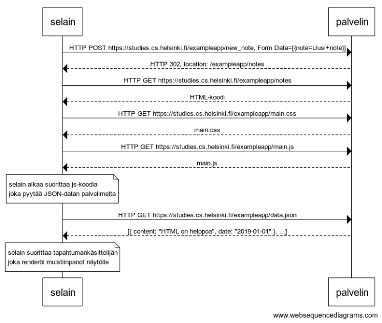

# 0.4 muistiinpano

Pohjaksi otettu tehtävänannon sekvenssikaavio, muutetut osat ovat alun HTTP POST ja paluunviestin Redirect



https://www.websequencediagrams.com/ source:

```
selain->palvelin: HTTP POST https://studies.cs.helsinki.fi/exampleapp/new_note, Form Data=[{note=Uusi+note}]
palvelin-->selain: HTTP 302, location: /exampleapp/notes
selain->palvelin: HTTP GET https://studies.cs.helsinki.fi/exampleapp/notes
palvelin-->selain: HTML-koodi
selain->palvelin: HTTP GET https://studies.cs.helsinki.fi/exampleapp/main.css
palvelin-->selain: main.css
selain->palvelin: HTTP GET https://studies.cs.helsinki.fi/exampleapp/main.js
palvelin-->selain: main.js

note over selain:
selain alkaa suorittaa js-koodia
joka pyytää JSON-datan palvelimelta
end note

selain->palvelin: HTTP GET https://studies.cs.helsinki.fi/exampleapp/data.json
palvelin-->selain: [{ content: "HTML on helppoa", date: "2019-01-01" }, ...]

note over selain:
selain suorittaa tapahtumankäsittelijän
joka renderöi muistiinpanot näytölle
end note
```