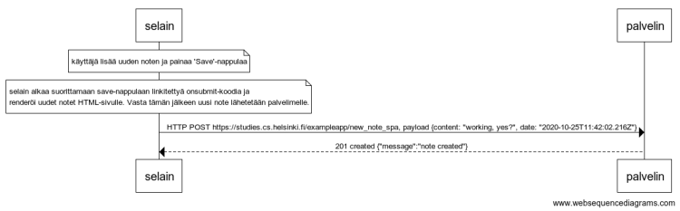

# 0.6 SPA uusi muistiinpano

Pohjaksi otettu tehtävänannon sekvenssikaavio



https://www.websequencediagrams.com/ source:

```
note over selain:
käyttäjä lisää uuden noten ja painaa 'Save'-nappulaa
end note

note over selain:
selain alkaa suorittamaan save-nappulaan linkitettyä onsubmit-koodia ja 
renderöi uudet notet HTML-sivulle. Vasta tämän jälkeen uusi note lähetetään palvelimelle.
end note

selain->palvelin: HTTP POST https://studies.cs.helsinki.fi/exampleapp/new_note_spa, payload {content: "working, yes?", date: "2020-10-25T11:42:02.216Z"}
palvelin-->selain: 201 created {"message":"note created"}
```